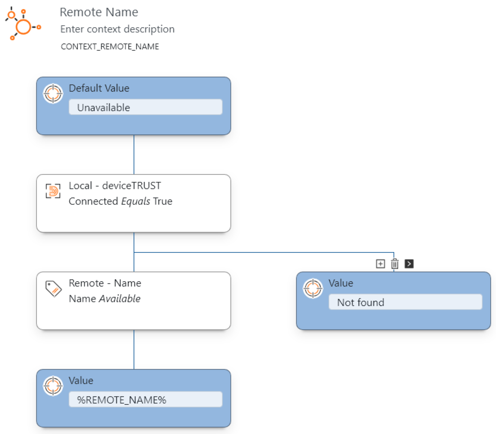
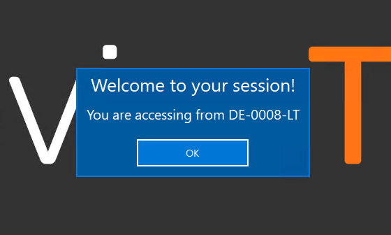
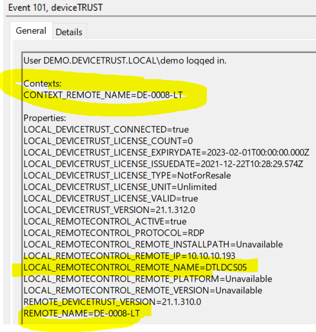

# 2 - Unmanaged Hops
This configuration can only be applied to deviceTRUST from version 21.1.314. It utilizes a on-to-one connection from the user's client to a target session by hopping over multiple deviceTRUST Client Extensions. It does only require a configured deviceTRUST Agent on the last top / target. This makes the configuration rather simple. 

It is intended to cater for scenarios in which one ore more hops are not in the customer's hands and thus might not be licensed and configurable to run a deviceTRUST Agent.

Read [our knowledge base article](https://app.hubspot.com/knowledge/7075732/edit/93463466337) for further information.

## Guide
| Machine | Software                     | Configuration                                                                                   |
|---------|------------------------------|-------------------------------------------------------------------------------------------------|
| Client  | deviceTRUST Client Extension | None                                                                                            |
| Hop 1-N | deviceTRUST Client Extension | None - Automatically connect to the next deviceTRUST Client Extension until a dT Agent is found |
| Target  | deviceTRUST Agent            | 1 - Build Context & Run Actions                                                                 |

### Configuration 1 - Build Context based on Properties & Run Actions ([dtpol configuration file](./dT_C_MH_2-UnmanagedHops_1_Target.dtpol)) 
This configuration is applied only to the deviceTRUST Agent. It is utilized to evaluate properties from the very first remote client that is found along the chain. You can either evaluate properties by creating a context or by adding the in the "Setting\Properties" configuration menu. The configuration in this repository uses the first method.

This Configuration
- Builds the Context "Remote Name", fetching the user's device's name from the Remote Properties.
- Displays an Action Center notification in the target Windows session.

| Build Context | Run Action | Forward Properties | Pop Up | Event Viewer |
|---------------|------------|--------------------|--------|--------------|
| |  |  |  |  |