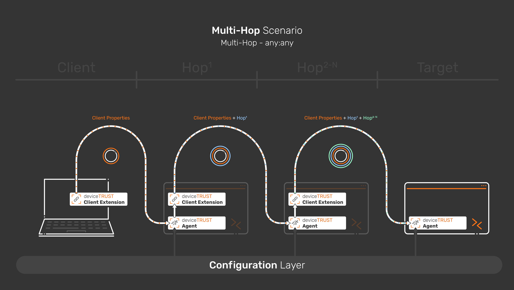
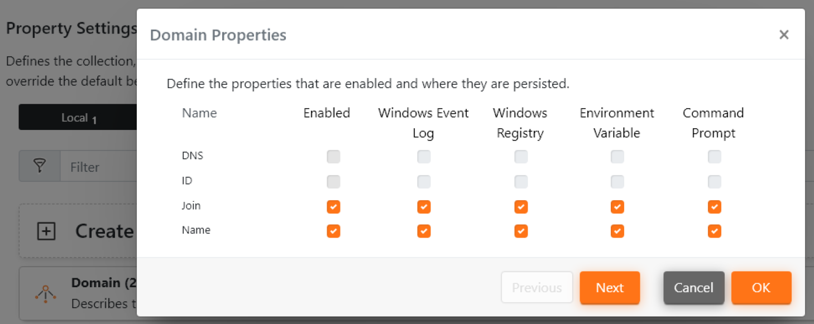
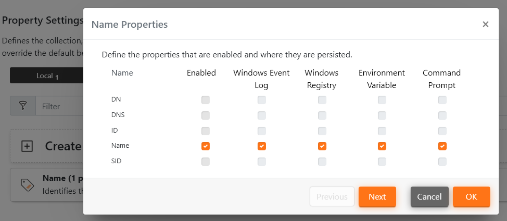
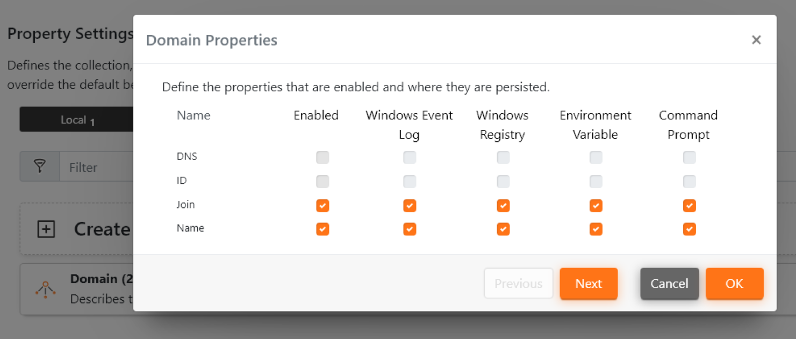
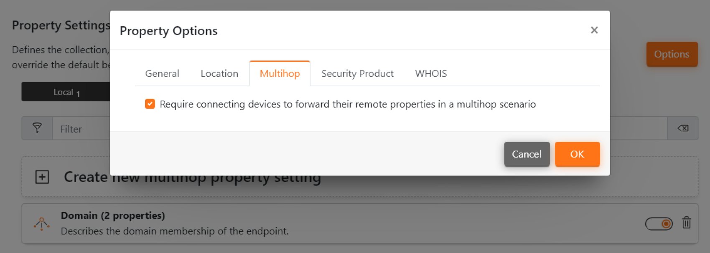
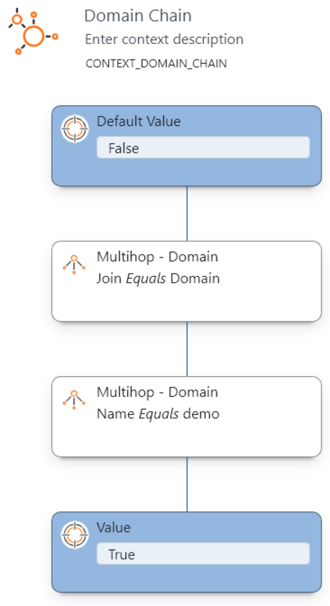
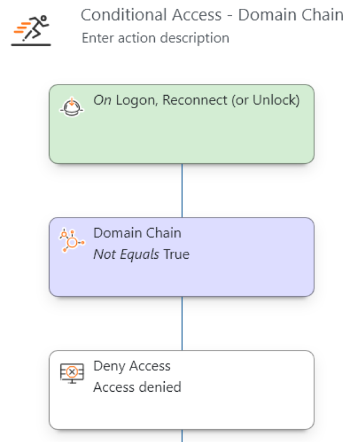
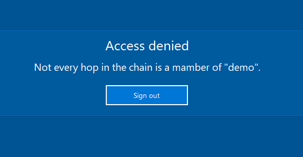
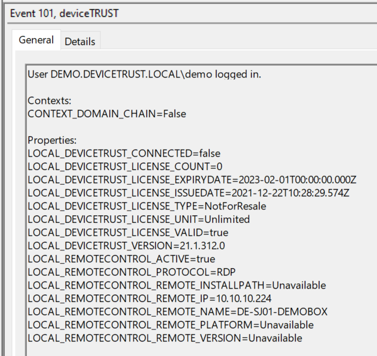
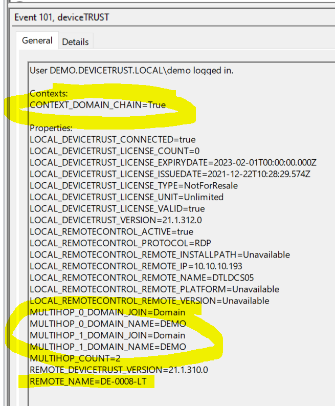

# 3 - Managed Hops with Properties

This scenario enables you to evaluate and use properties on every client, hop and target in a multi-hop scenario. As the possibilities of this setup are pretty vast, a very simple example is given here.

This configuration can be applied to deviceTRUST Agents in a Multi-Hop scenario, where a licensed deviceTRUST Agent is deployed and configured on every hop along the chain. It does, thus, cater only for Multi-Hop scenarios in the networks of deviceTRUST customers. The "Managed Hops with Properties" scenario can be implemented with the deviceTRUST standard components. It gives full flexibility of the multi-hop path and the data to be evaluated.

Read [our knowledge base article](https://app.hubspot.com/knowledge/7075732/edit/93463466337) for further information.

## Guide

This configuration

- Evaluates the user's device's name, forwards it to the target and shows a pop up there.
- Evaluates the domain membership of the hops in-between. The connection to the target is only allowed if all hops are member of the correct domain ("demo").

| Machine | Software                                            | Configuration                                                                          |
|---------|-----------------------------------------------------|----------------------------------------------------------------------------------------|
| Client  | deviceTRUST Client Extension                        | None                                                                                   |
| Hop 1   | deviceTRUST Client Extension   deviceTRUST Agent | 1 - Evaluate Remote Properties & Evaluate Local properties                             |
| Hop 2-N | deviceTRUST Client Extension   deviceTRUST Agent | 2 - Forward Properties, Evaluate Multi-Hop properties & Evaluate Local properties      |
| Target  | deviceTRUST Agent                                   | 3 - Build Context & Run Actions                                                        |

### Configuration 1 - Evaluate Remote Properties & Evaluate local properties ([dtpol configuration file](./dT_C_MH_3-ManagedHopswithProperties_1_Hop1.dtpol))

The first configuration is applied only to the first hop. It evaluates the domain membership of the first hop. Also, it evaluates the user's device's name.

This Configuration

- Uses the "Properties\Local" setting in the "Settings" menu to evaluate the domain membership of the local hop.
- Uses the "Properties\Remote" setting in the "Settings" menu to evaluate the user's device's name.

| Evaluate the "Local" domain membership | Evaluate the user's device's name. |
|----------------------------------------|------------------------------------|
| |  |

### Configuration 2 - Forward Properties & Evaluate local properties ([dtpol configuration file](./dT_C_MH_3-ManagedHopswithProperties_2_Hop2-HopN.dtpol))

The second configuration is applied to any hop along the connection chain. On every hop, the domain membership is evaluated. Also, the user's device's name is forwarded.

This Configuration

- Uses the "Properties\Local" setting in the "Settings" menu to evaluate the domain membership of the local hop.
- Uses the "Properties\MultiHop" setting in the "Settings" menu to evaluate the domain membership of the previous hop(s).
- Forwards the user's device's name.

| Evaluate the "Local" domain membership | Evaluate the "MultiHop" domain membership of the previous hop(s). | Forward the user's device's name |
|----------------------------------------|-------------------------------------------------------------------|----------------------------------|
| |  |  |

### Configuration 3 - Build Context based on Properties & Run Actions ([dtpol configuration file](./dT_C_MH_3-ManagedHopswithProperties_3_Target.dtpol))

The third configuration is applied only to the target. It is utilized to build context and run actions. In the example use case, it blocks the session if one hop along the chain is mot joined to the domain "demo". Also, the user's device's name is evaluated.

This Configuration

- Builds the Context "Domain Chain", evaluating, if every hop is joined to the domain "demo".
- Runs an Action on Logon and Reconnect, that denies access to the session, if at least one hop is not a member of the domain "demo".
- Evaluates the user's device's name and outputs it to the logon event.

| Build Context | Run Actions | Deny Access | Event Viewer - False | Event Viewer - True |
|---------------|-------------|-------------|----------------------|---------------------|
| |  |  |  |  |
