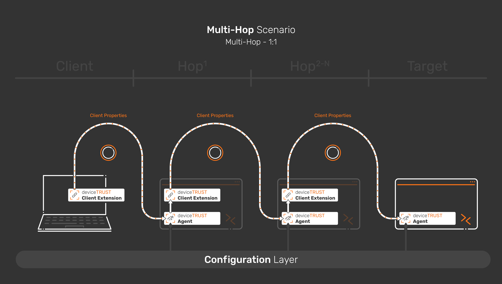
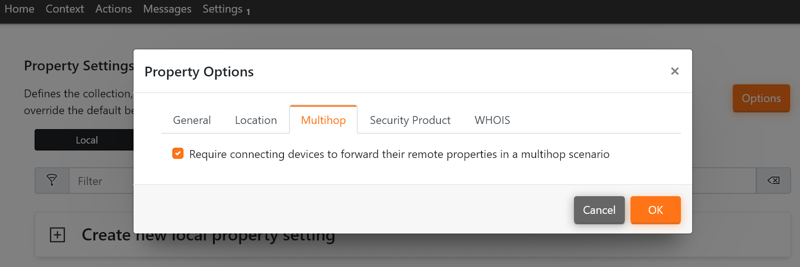
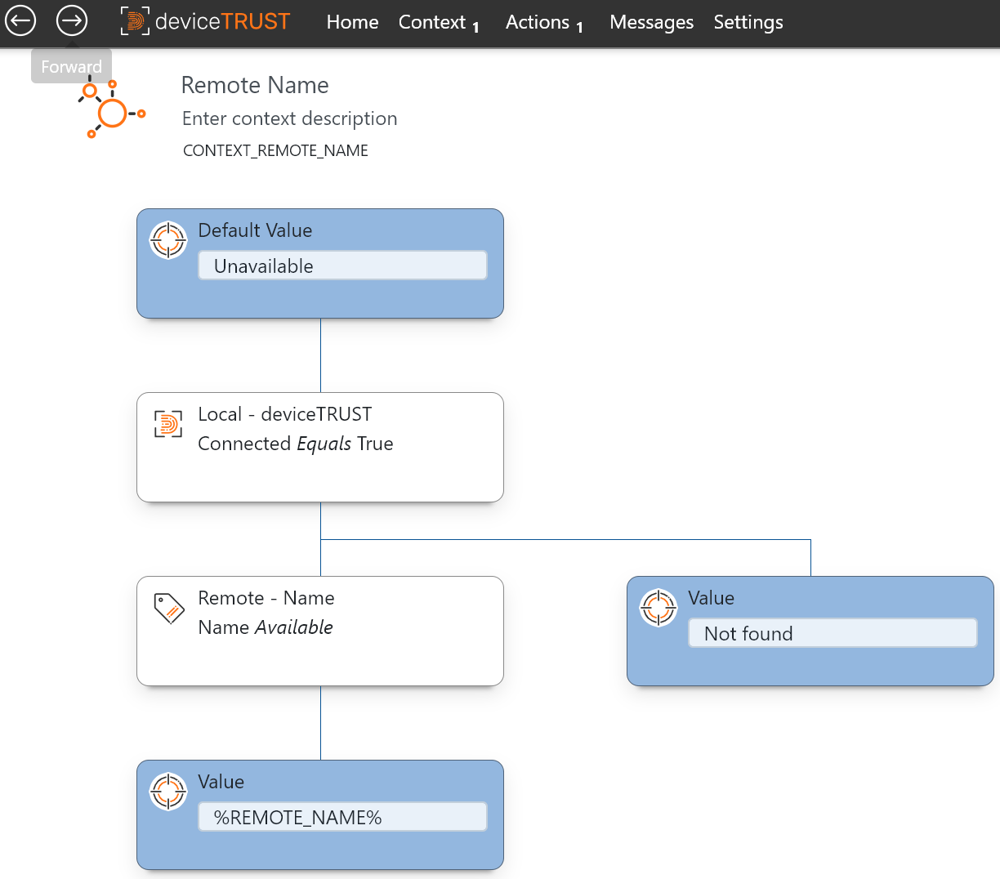
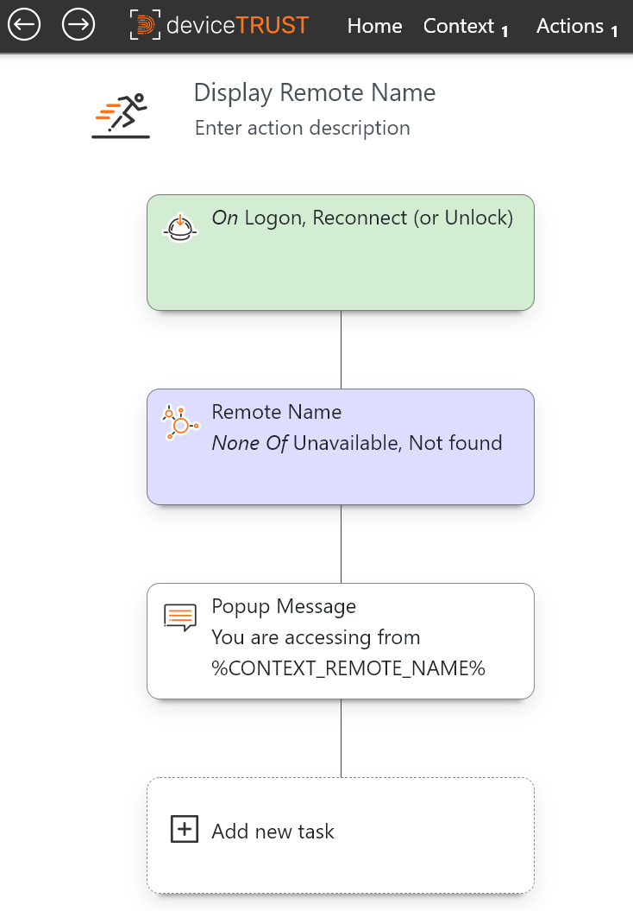
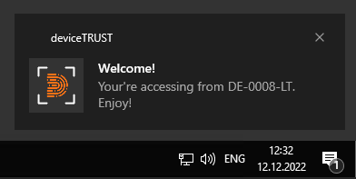
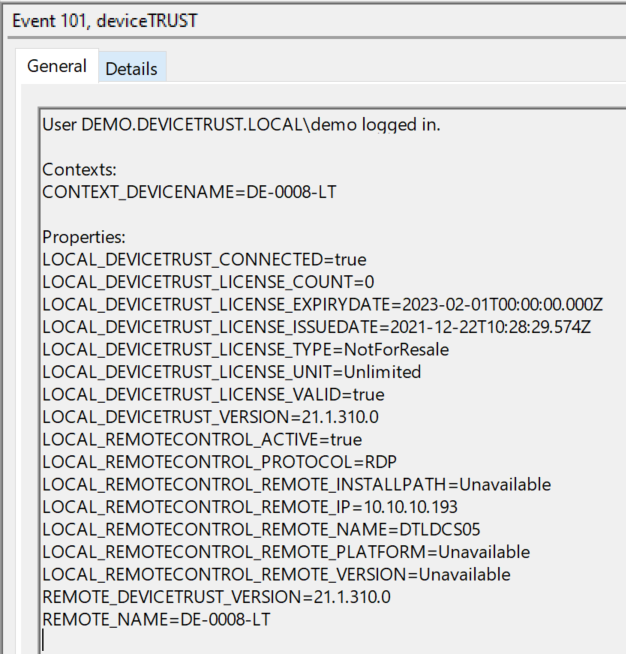

# 1 - Managed Hops
This configuration can be applied to deviceTRUST Agents in a Multi-Hop scenario where a licensed deviceTRUST Agent is deployed on every hop along the chain. It does, thus, cater mainly for Multi-Hop scenarios in the networks of deviceTRUST customers. 

The "Managed Hops" scenario can be implemented with the deviceTRUST standard components. It gives full flexibility of the Multi-Hop path and the data to be evaluated.

Read [our knowledge base article](https://app.hubspot.com/knowledge/7075732/edit/93463466337) for further information.

## Guide
| Machine | Software                                            | Configuration                   |
|---------|-----------------------------------------------------|---------------------------------|
| Client  | deviceTRUST Client Extension                        | None                            |
| Hop 1   | deviceTRUST Client Extension   deviceTRUST Agent | 1 - Evaluate Properties         |
| Hop 2-N | deviceTRUST Client Extension   deviceTRUST Agent | 2 - Forward Properties     |
| Target  | deviceTRUST Agent                                   | 3 - Build Context & Run Actions |

### Configuration 1 - Evaluate Properties ([dtpol configuration file](./dT_C_MH_1-ManagedHops_1_Hop1.dtpol)) 
The first configuration is applied to the first hop in the chain. It is utilized to evaluate properties from the remote client. You can either evaluate properties by creating a context or by adding the in the "Setting\Properties" configuration menu. The configuration in this repository uses the second method.

This Configuration
- Uses the "Properties" setting in the "Settings" menu to evaluate the name of the user's device.

### Configuration 2 - Forward Properties ([dtpol configuration file](./dT_C_MH_1-ManagedHops_2_Hop2-HopN.dtpol)) 
The second configuration is applied to any hop along the chain that is not the first and not the target. It is utilized to forward the evaluated client properties.

This Configuration
- Uses the "Properties\Property Options" setting in the "Settings" menu. There you'll find the "Multi-Hop" tab, where "Require connecting devices to forward their remote properties in a multi-hop scenario" needs to be checked.

### Configuration 3 - Build Context based on Properties & Run Actions ([dtpol configuration file](./dT_C_MH_1-ManagedHops_3_Target.dtpol)) 
The third configuration is applied only to the target. It is utilized to build context and run actions. In the example use case, it gets the Remote Device's name from the Remote Properties and displays it as Action Center notification in the target session.

This Configuration
- Builds the Context "Remote Name", fetching the user's device's name from the Remote Properties.
- Displays an Action Center notification in the target Windows session.

| Build Context | Run Action | Pop Up | Event Viewer |
|---------------|------------|--------|--------------|
| |  |  |  |