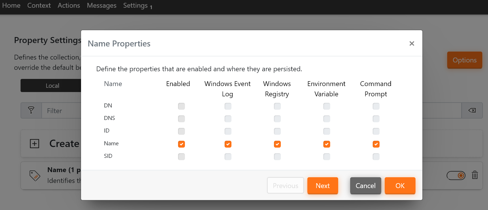

# 1. Managed Hops
This configuration can be applied to deviceTRUST Agents in a Multi-Hop scenario where a licensed deviceTRUST Agent is deployed on every hop along the chain. It does, thus, cater mainly for Multi-Hop scenarios in the internal networks of deviceTRUST customers. The "managed hops" scenario can be implemented with the deviceTRUST standard components. It gives full flexibility of the multi-hop path and the data to be evaluated.

Contains the configuration as described in https://app.hubspot.com/knowledge/7075732/edit/93463466337

## Guide
The configuratiuon(s) shown here are a basic example to give an Idea of how multi-hop can be implemeted with deviceTRUST. They may or may not comply with how your environemnt is designed. They will, in any case, give you an idea of which information and settings are required in which place. If you have any questions regarding the implementation, please do no hesitate getting back to us!

| Machine            | Software                                            | Configuration                                          |
|--------------------|-----------------------------------------------------|--------------------------------------------------------|
| Client             | deviceTRUST Client Extension                        | None                                                   |
| Hop 1              | deviceTRUST Client Extension   deviceTRUST Agent | 1 - Evaluate Properties                                |
| Hop 2-N            | deviceTRUST Client Extension   deviceTRUST Agent | 2 - Push Properties forward                            |
| Final Hop / Target | deviceTRUST Agent                                   | 3 - Build Context based on Properties   Run Actions |

### Configuration 1 - Evaluate Properties
The first configuration is applied to the first hop in the chain. It is utilized to evaluate properties from the remote client. You can either evaluate properties by creating a context or by adding the in the "Setting\Properties" configuration menu. The configuration in this repository uses the second method.

This Configuration
- Uses the "Property" sessting in the "Settings" menu to evaluate the "Name" property of the "Remote" client.

### Configuration 2 - Push Properties forward  
### Configuration 3 - Build Context based on Properties & Run Actions