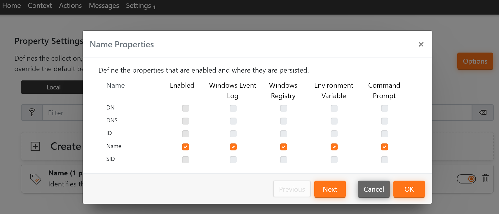

# 2. Unmanaged Hops
This configuration can only be applied to deviceTRUST from version 21.1.314. It utilizes a on-to-one connection from the user's client to a target session by hopping over multiple deviceTRUST Client Extensions. It does only require a configured deviceTRUST Agend on the last top / target. This makes the configuration rather simple. 
It is intended to cater for scenarios in which one ore more hops are not in the customer's hands and thus might not be licensed and configurable to run a deviceTRUST Agent.

Read [our knowledge base article](https://app.hubspot.com/knowledge/7075732/edit/93463466337) for further information.

## Guide
| Machine            | Software                     | Configuration                                                             |
|--------------------|------------------------------|---------------------------------------------------------------------------|
| Client             | deviceTRUST Client Extension | None                                                                      |
| Hop 1-N            | deviceTRUST Client Extension | None - Automatically connect to the next deviceTRUST Client Extension until Agent is found |
| Final Hop / Target | deviceTRUST Agent            | 1 - Build Context based on Properties   Run Actions                    |

### Configuration 1 - Build Context based on Properties & Run Actions ([dtpol configuration file](./dT_C_MH_1-UnmanagedHops_1_Target.dtpol)) 
This configuration is applied only to the agent in this scenario. It is utilized to evaluate properties from very first remote client that is found along the chain. You can either evaluate properties by creating a context or by adding the in the "Setting\Properties" configuration menu. The configuration in this repository uses the second method.

This Configuration
- Uses the "Properties" setting in the "Settings" menu to evaluate the "Name" property of the "Remote" client.

The configuration will automatically be applied to the first deviceTRUST Client Extension found in the chain. No further configuration is required.