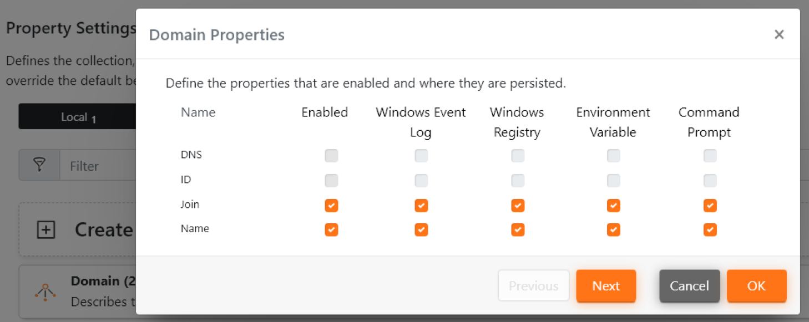
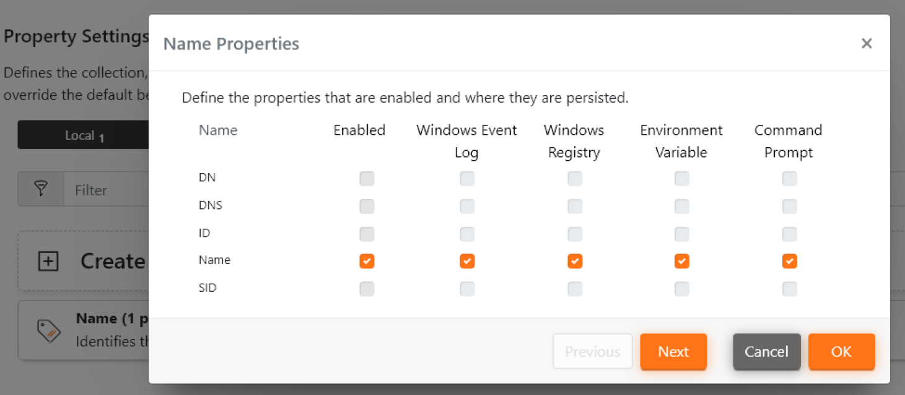
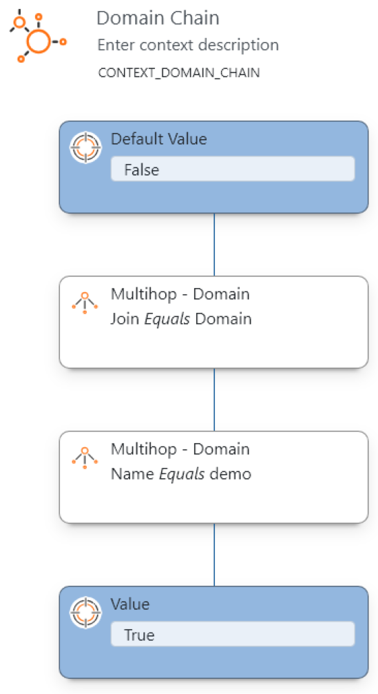
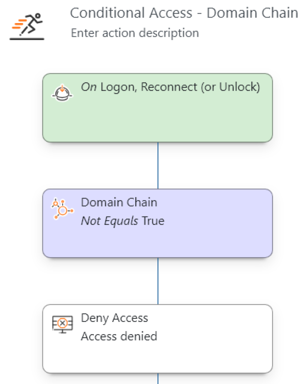
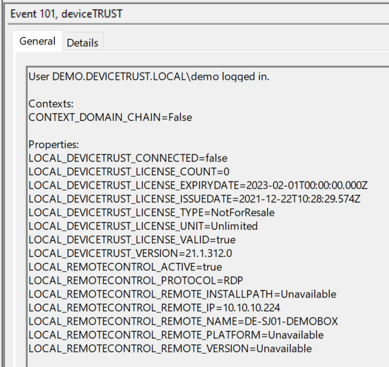

# 3. Managed Hops with Properties
This configuration can be applied to deviceTRUST Agents in a Multi-Hop scenario where a licensed deviceTRUST Agent is deployed on every hop along the chain. It does, thus, cater mainly for Multi-Hop scenarios in the internal networks of deviceTRUST customers. The "Managed Hops with Properties" scenario can be implemented with the deviceTRUST standard components. It gives full flexibility of the multi-hop path and the data to be evaluated.

This scenario enables you to evaluate and use properties on every hop in a multi-hop scenario. As the possibilities of this setup are pretty vast, a very simple example is given here.

Contains the configuration as described in https://app.hubspot.com/knowledge/7075732/edit/93463466337

## Guide
This configuration
- Evaluates the user device's name, pushes it through to the target and shows a pop up there.
- Evaluates the domain membership of the hops in-between. The connection to the target is only allowed if all hops are member of the correct domain.

| Machine            | Software                                            | Configuration                                                 |
|--------------------|-----------------------------------------------------|---------------------------------------------------------------|
| Client             | deviceTRUST Client Extension                        | None                                                          |
| Hop 1              | deviceTRUST Client Extension   deviceTRUST Agent | 1 - Evaluate Remote Properties   Evaluate local properties |
| Hop 2-N            | deviceTRUST Client Extension   deviceTRUST Agent | 2 - Push Properties forward   Evaluate local properties    |
| Final Hop / Target | deviceTRUST Agent                                   | 3 - Build Context based on Properties   Run Actions        |

### Configuration 1 - Evaluate Remote Properties & Evaluate local properties (dT_C_MH_3-ManagedHopswithProperties_1_Hop1.dtpol)
The first configuration is applied only to the first hop. It evaluates the domain membership of the first hop. Also, it evaluates the user's device's name.

This Configuration
- Evaluates the "LOCAL" domain membership.
- Evaluates the user's device's name.

| Evaluate the "LOCAL" domain membership | Evaluate the user's device's name. |
|----------------------------------------|------------------------------------|
| |  |

### Configuration 2 - Push Properties forward & Evaluate local properties(dT_C_MH_3-ManagedHopswithProperties_2_Hop2-HopN.dtpol)
The second configuration is applied only to any hop along the connection chain. On every hop, the domain membership is evaluated. Also, the user's device's name is pushed forward.

This Configuration
- Evaluates the "LOCAL" domain membership.
- Evaluates the "MULTI_HOP" domain membership of the previous hop(s).
- Pushes forward the user's device's name.

| Evaluate the "LOCAL" domain membership | Evaluate the "MULTI_HOP" domain membership of the previous hop(s). | Push forward the user's device's name |
|----------------------------------------|--------------------------------------------------------------------|---------------------------------------|
| |  |  |

### Configuration 3 - Build Context based on Properties & Run Actions (dT_C_MH_3-ManagedHopswithProperties_3_Target.dtpol)
The third configuration is applied only to the last hop / target. It is utilized to build context and run actions. In the example use case, it blocks the session if one hop along the chain is mot joined to the domain "demo". Also, the user's device's name is evaluated.

This Configuration
- Builds the Context "Domain Chain", evaulauting, if every hop is joined to the domain "demo".
- Denies access to the session, if at least one hop is not a member of "demo".
- Evaluates the user's device's name and outputs it to the logon event.

| Build Context | Run Actions | Deny Access | Event Viewer - False | Event Viewer - True |
|---------------|-------------|-------------|----------------------|---------------------|
| |  |  |  |  |